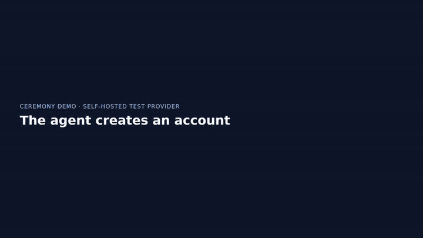
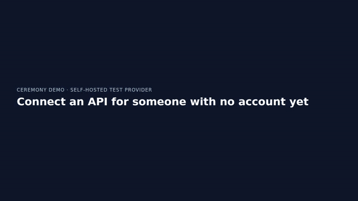
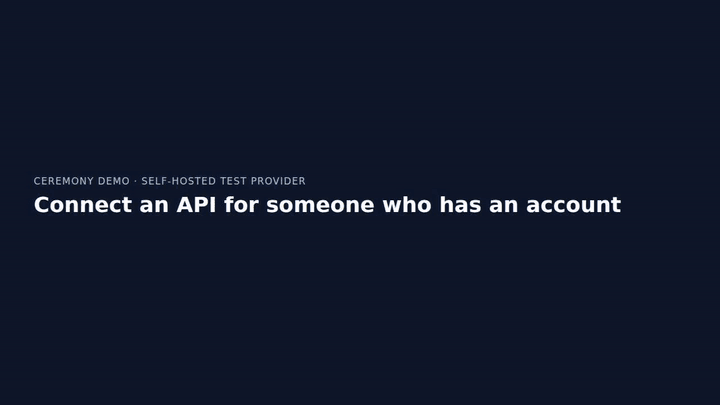

# Demo videos

These are short screen recordings of an agent doing auth ceremonies end to end. They are made with [webreel](https://github.com/vercel-labs/webreel) (`@webreel/core`), and every action on a provider page is performed by Ceremony's own driver. They run against this repository's [self-hosted test provider](auth-scenario-doubles.md), served in its realistic layouts. Each layout is an invented product (Northwind Cloud, Acme Accounts, Globex Workspace), not a real service, and no real account is involved.

Account registration comes first because API-driven agents most often fail at it. To register, an agent has to get an address it can actually receive mail at, fill a form it has never seen, read an emailed code and prove the account exists.

## The videos

### 1. The agent creates an account



[MP4](demos/agent-creates-account.mp4) · Northwind Cloud, classic-card layout · scenario `registration-with-emailed-code`

On a sign-up form the agent has never seen, it fills:

- the full name;
- the work email, using a fresh address from the agent inbox;
- a generated password and its confirmation, both masked.

It then ticks the required terms box and creates the account. On "Check your email" the inbox panel shows the confirmation email arriving and the code being extracted; the code is never printed. The agent enters the code and verifies. The provider confirms the account exists.

### 2. Connect an API for someone with no account yet: the stitched run



[MP4](demos/connect-without-account.mp4) · Acme Accounts, identifier-first layout · scenario `authorization-requires-registration-first`

1. The connector starts an OAuth authorization-code request with PKCE.
2. The provider's sign-in page is where the missing account shows up. The caption states the decision ("No account at Acme Accounts → register"), and the agent follows "Create account" without typing anything into the sign-in form.
3. It registers with a fresh inbox address.
4. It verifies the address with the emailed code.
5. It returns to the consent screen the original request was waiting on and presses Allow.
6. The browser lands on the connector's own callback page. The connector redeems the code with its verifier.
7. The connector checks that the token names the account just made, and that the same code is refused on replay.

A side panel and the caption row show the chain position (`Step 4/7 · verify email via inbox`). It advances from what the driver was about to do and on which page, never from elapsed time.

### 3. Connect an API for someone who has an account



[MP4](demos/connect-with-account.mp4) · Acme Accounts, identifier-first layout

This uses the same authorization request, but the person already has an account, so the decision is "account exists → sign in". The agent enters the email, then the password on its own page. On "Two-factor authentication" it enters the current RFC 6238 code, which `totpCode` derives from the held seed at the moment of filling; the seed is never typed or shown. Consent, callback and redemption then follow as in the stitched run.

### 4. Registration recovers from a taken address

Globex Workspace, split-panel layout · scenario `registration-recovers-with-fresh-address` · `npm run demos:record -- registration-recovers`

The person's usual address is already registered. The provider answers with "An account with this email already exists". The agent inbox issues a fresh address, and the agent fills the form again with it and finishes registration. The original account is left untouched, and exactly one new account exists.

### 5. Record once, replay with no model

Northwind Cloud · `npm run demos:record -- record-once-replay`

The first registration is interpreted and recorded through the driver's `onApplied` seam. `compileRecording` turns it into value-free steps with every resolved value excluded. A second registration, for a new inbox address, is replayed from that recording by `runRecordedCeremony` with no fallback, and the end card compares interpreter calls: 9 against 0.

Demos 4 and 5 are not committed as media; the commands above regenerate them.

## What is real and what is a double

| Layer               | In the videos                                                                                                                                                                                                                                                                                                         |
| ------------------- | --------------------------------------------------------------------------------------------------------------------------------------------------------------------------------------------------------------------------------------------------------------------------------------------------------------------- |
| Provider            | **Double.** The self-hosted test provider in `tests/doubles/auth-provider`, in a realistic layout (`layouts.ts`). It serves real HTML over real HTTP with sessions, validation, confirmation mail, RFC 6238 second factor, and authorization code + PKCE. Each title card names the product, the layout and the seed. |
| Browser             | Real Chrome, launched and recorded by `@webreel/core`.                                                                                                                                                                                                                                                                |
| Driver              | Real: `runCeremony` and `runRecordedCeremony` over `createPlaywrightCeremonyPage`, attached to webreel's Chrome over CDP.                                                                                                                                                                                             |
| Next-step decisions | Real: `createHeuristicInterpreter`, the production model-free interpreter. It reads only the sanitized snapshot. No model is called and no test double decides anything.                                                                                                                                              |
| Secrets             | Real generators: `generateIsolatedAccount` for passwords, and `totpCode` from a synthetic seed for the second factor.                                                                                                                                                                                                 |
| Agent inbox         | Real adapter and extraction (`createHttpInbox`, `verificationFromMessage`). **Mail transport is simulated:** a small local service exposes the provider double's outbox in the inbox contract.                                                                                                                        |
| OAuth client        | **Double.** The test provider's relying-party helper builds the authorization request and redeems the code. The callback lands on a separate local "connector" origin, as it would in production.                                                                                                                     |

## What a video may show

A recording is made to be shared, so it is held to a stricter rule than a transcript. Captions, side panels and cards name **who** acted and **which step** they took, never **what** they typed.

- Every caption and panel row comes from closed vocabularies in `scripts/demos/captions.ts`. `tests/demos-captions.test.ts` pushes canary passwords, codes, links, tokens and addresses through every field of every entry point, including fields the types do not allow.
- A scenario marks each value it handles with `protect`: generated passwords, every code and link the inbox serves, TOTP codes and every spelling of the seed, the PKCE verifier and the access token. The recorder refuses to keep a video if one of them reached a caption, a card or the driver's transcript.
- After every driver run, `assertFillsMatchLabels` (`tests/doubles/fill-labels.ts`, the same gate the contract suites use) checks each fill the driver applied against the field's label, type, autocomplete and name. It also checks that no forward button was pressed while a required field was still empty. A mismatch fails the recording.
- A video must cover its run. A take whose frames cover less than 80% of the run's wall time is refused and recorded again. A screenshot can stall, and a busy machine makes webreel fold captures, so the video would otherwise freeze or run fast.
- The page masks password fields. A verification or authenticator code is visible in the provider's own input while the driver fills it; it is a synthetic, single-use value, and no caption or panel prints it. Synthetic addresses (`*.invalid`, `*.test`) appear in forms and on the provider's pages.

## How it is built

`scripts/demos/harness.ts` watches the driver without steering it. It has two seams:

1. The interpreter is wrapped, so each proposal becomes a caption before the driver acts on it. A short pause lets a viewer read it.
2. The Playwright page given to the adapter returns element handles whose `fill`, `click` and `check` first move webreel's cursor to that control. Then the driver's own action runs.

Neither seam changes what the driver decides, sees or submits, and nothing is injected into a provider page. The window is an ordinary 1280x720 browser. A control near an edge is scrolled to the middle before the driver acts on it, and a consent screen is scrolled so its buttons are in view. The side panels are rendered separately and overlaid on the video afterwards.

webreel's own headless mode starts `chrome-headless-shell` with begin-frame control. That stops `requestAnimationFrame`, and with it Playwright's actionability checks. The harness therefore gives webreel's launcher a small wrapper that runs Playwright's Chromium with `--headless=new` and a fixed window size. Set `DEMO_CHROME_BINARY` to use a different Chrome.

## Regenerating

```sh
npm run demos:record                                # every demo, in catalog order
npm run demos:record -- agent-creates-account       # one demo by id
npm run demos:record -- --docs                      # also refresh docs/demos/
```

Output goes to `artifacts/demos/<id>.mp4`, with a poster at `<id>.png`. `artifacts/` is ignored, so a video is regenerated, never edited. `--docs` also writes a small MP4, a GIF and the poster into `docs/demos/` for the demos marked `docsPreview`.

Each demo takes one to two minutes to record and encode. Recording is not part of `npm test`; the catalog, phase and caption rules are, as pure unit tests.

webreel needs an ffmpeg with `libx264`. It looks, in order, at `FFMPEG_PATH`, a copy under `~/.webreel/bin/ffmpeg`, a download, and `ffmpeg` on `PATH`. The Linux download URL currently returns 404, so on Linux install a static ffmpeg (for example the johnvansickle.com build) and set `FFMPEG_PATH` or put it on `PATH`.

## What the videos do not show

- Any real provider. Recording a live provider would retain exactly what verification is forbidden to keep, so this is never pointed at one. See [auth scenario doubles](auth-scenario-doubles.md).
- A model. The interpreter on screen is the production model-free one; model quality is not demonstrated here.
- Real mail delivery. The inbox adapter and code extraction are real; SMTP is not.
- A person accepting terms. The model-free interpreter ticks a required terms checkbox itself, and the caption says so.
- One run across two providers. Per-node run context is proven at the recipe level (`tests/cross-provider-runs.test.ts`), but no browser demo exists yet. It needs a provider double that accepts an OAuth client created at another provider, and a way for a step to use a `common.oauth-client` handle there.
- The Ceremony app UI. These videos show the isolated browser the agent drives, not the product surface that starts a run.
